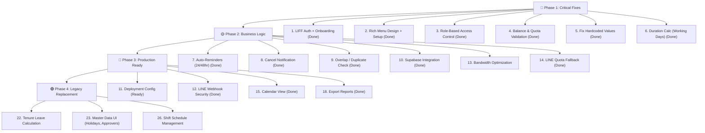

# 🏥 Doctor Leave @ LINE — สรุปสถานะโปรเจกต์ & แผนงาน

## สถานะปัจจุบัน: ✅ MVP Core ทำไปแล้ว ~70%

โปรเจกต์มีโครงสร้างครบ (Backend + Frontend + DB Schema + LINE Integration) แต่ยังมีส่วนที่ต้องทำและแก้ไขอีกหลายจุด

---

## ✅ สิ่งที่ทำเสร็จแล้ว (Done)

| # | ฟีเจอร์ | สถานะ | ไฟล์หลัก |
|---|---------|--------|----------|
| 1 | Database Schema ครบ 11 ตาราง + Triggers + Seed Data | ✅ เสร็จ | [supabase_schema.sql](file:///d:/doctor-leave-line/supabase_schema.sql) |
| 2 | Local JSON DB + Supabase Fallback (Dual Mode) | ✅ เสร็จ | [db.js](file:///d:/doctor-leave-line/server/db.js) |
| 3 | REST API ครบ (CRUD Leave Requests, Approve, Reject, Override, Cancel) | ✅ เสร็จ | [api.js](file:///d:/doctor-leave-line/server/routes/api.js) |
| 4 | LINE Flex Messages 4 แบบ (ยืนยัน, ขออนุมัติ, ผลอนุมัติ, ฉุกเฉิน) | ✅ เสร็จ | [line.js](file:///d:/doctor-leave-line/server/line.js) |
| 5 | หน้ายื่นใบลา LIFF (แพทย์) + Quota Check + Emergency Detect | ✅ เสร็จ | [DoctorLiffPage.jsx](file:///d:/doctor-leave-line/src/pages/DoctorLiffPage.jsx) |
| 6 | หน้าศูนย์อนุมัติ (หัวหน้าแผนก) | ✅ เสร็จ | [ApproverPage.jsx](file:///d:/doctor-leave-line/src/pages/ApproverPage.jsx) |
| 7 | หน้า Admin Dashboard พี่กุ้ง + Override + บันทึกแทน | ✅ เสร็จ | [AdminDashboardPage.jsx](file:///d:/doctor-leave-line/src/pages/AdminDashboardPage.jsx) |
| 8 | หน้าตั้งค่าเกณฑ์โควตาแผนก | ✅ เสร็จ | [AdminCriteriaPage.jsx](file:///d:/doctor-leave-line/src/pages/AdminCriteriaPage.jsx) |
| 9 | หน้า Audit Log (PDPA) | ✅ เสร็จ | [AdminAuditPage.jsx](file:///d:/doctor-leave-line/src/pages/AdminAuditPage.jsx) |
| 10 | ประวัติการลาของแพทย์ | ✅ เสร็จ | [DoctorHistoryPage.jsx](file:///d:/doctor-leave-line/src/pages/DoctorHistoryPage.jsx) |
| 11 | Persona Switcher (สลับ Role สำหรับ Demo/Test) | ✅ เสร็จ | [PersonaSwitcher.jsx](file:///d:/doctor-leave-line/src/components/PersonaSwitcher.jsx) |
| 12 | LINE Simulator Modal (ดู Flex Messages จำลอง) | ✅ เสร็จ | [LineSimulatorModal.jsx](file:///d:/doctor-leave-line/src/components/LineSimulatorModal.jsx) |
| 13 | LINE Webhook (Postback 1-Click Approve) | ✅ เสร็จ | [api.js L917-971](file:///d:/doctor-leave-line/server/routes/api.js#L917-L971) |
| 14 | File Upload (แนบเอกสาร Multer) | ✅ เสร็จ | [api.js L30-52](file:///d:/doctor-leave-line/server/routes/api.js#L30-L52) |
| 15 | Automated Test Workflow | ✅ เสร็จ | [test_workflow.js](file:///d:/doctor-leave-line/test_workflow.js) |

---

## 🔴 สิ่งที่ต้องทำ/แก้ไข (Critical)

### 1. 🔐 LINE LIFF Authentication ยังไม่ได้ต่อจริง
**ปัจจุบัน:** ใช้ Persona Switcher (สลับ User แมนนวล) สำหรับ Demo เท่านั้น  
**ต้องทำ:** ต่อ LIFF SDK จริงเพื่อดึง LINE User ID อัตโนมัติ → ผูกกับ `doctors.line_user_id`  
**ไฟล์ที่เกี่ยว:** [AuthContext.jsx](file:///d:/doctor-leave-line/src/context/AuthContext.jsx), [main.jsx](file:///d:/doctor-leave-line/src/main.jsx)

> [!IMPORTANT]
> PRD บอกว่า "ผูก LINE ID กับรหัสแพทย์ในระบบ **ครั้งแรกครั้งเดียว** เข้าใช้งานครั้งต่อไปไม่ต้องล็อกอินซ้ำ" — ต้องสร้างหน้า **Onboarding / Link Account** ให้แพทย์ยืนยันรหัสพนักงานครั้งแรก

### 2. 📡 Supabase ยังเป็น Fallback ไม่ได้ใช้จริง
**ปัจจุบัน:** API ทั้งหมดใช้ Local JSON Store (`server/data/store.json`)  
**ต้องทำ:** เชื่อม API Routes ให้ query Supabase จริง เมื่อ `isSupabaseConfigured === true`

> [!WARNING]
> ตอนนี้ `db.js` สร้าง Supabase client ไว้แล้วแต่ **api.js ไม่ได้เรียกใช้เลย** ทุก route ใช้ `getDb()` (JSON file) อย่างเดียว

### 3. ⏰ Auto-Reminder ยังไม่มี
**PRD กำหนด:**
- ค้างอนุมัติ > 24 ชม. → ส่ง LINE Reminder สะกิดผู้อนุมัติ
- ค้างอนุมัติ > 48 ชม. → แจ้งพี่กุ้ง
- แนบเอกสารตามหลัง → Reminder เตือนแพทย์ภายใน 3 วัน

**ต้องทำ:** สร้าง Cron Job / Scheduled Task สำหรับ reminder

### 4. 🚀 Production Deployment ยังไม่ได้ตั้งค่า
- ไม่มี `Dockerfile` / `docker-compose.yml`
- ไม่มี deployment config (Vercel, Railway, etc.)
- `APP_URL` ยัง hardcode เป็น `localhost:5173`
- Emergency Alert Flex Message ยัง hardcode URL Admin Dashboard เป็น `http://localhost:5173/admin`

### 5. 📋 LINE Rich Menu ยังไม่ได้สร้าง (สำคัญมาก — จุดเข้าใช้งานหลัก)
**PRD กำหนด:** แพทย์เปิด LINE OA แล้วแตะ Rich Menu "ยื่นใบลา" → เปิด LIFF  
**อ้างอิง:** รูปแบบคล้าย Rich Menu ของ KBank Live ที่มีปุ่มใหญ่ชัดเจน กดง่าย

**สิ่งที่ต้องทำ:**
1. **ออกแบบภาพ Rich Menu** (ขนาด 2500x1686px หรือ 2500x843px) แบ่งเป็น 3-4 ช่อง:
   - 📝 **ยื่นใบลา** → เปิด LIFF หน้าแบบฟอร์มลา
   - 🕒 **ประวัติ / สิทธิ์คงเหลือ** → เปิด LIFF หน้าประวัติการลา
   - 📞 **ติดต่อพี่กุ้ง (ฉุกเฉิน)** → โทรออก / ส่งข้อความด่วน
   - ⚙️ **เมนูอื่นๆ** (ถ้าต้องการ) → เช่น ดูปฏิทินแผนก
2. **ตั้งค่าผ่าน LINE Official Account Manager** หรือ Messaging API
3. **ผูก Action ของแต่ละปุ่ม** → URI (LIFF URL) / Tel / Postback

> [!IMPORTANT]
> Rich Menu คือ **สิ่งแรกที่แพทย์เห็น** เมื่อเปิด LINE OA ถ้าไม่มี Rich Menu แพทย์จะไม่รู้ว่าต้องกดอะไร Adoption Rate จะต่ำ ควรทำพร้อม LIFF Auth

---

## 🟡 สิ่งที่ต้องปรับปรุง (Medium Priority)

### 6. 🛡️ ระบบสิทธิ์เข้าถึง (Role-Based Access Control) ไม่มีเลย
**สถานะปัจจุบัน: ❌ ไม่มีระบบสิทธิ์ทั้ง Frontend และ Backend**

**ปัญหาที่พบ:**

| ชั้น | ปัญหา | ความเสี่ยง |
|------|--------|------------|
| **Frontend (Navbar)** | แสดง **ทุกเมนูให้ทุก Role** — แพทย์เห็น Admin Dashboard, เกณฑ์โควตา, Audit Log ได้หมด | แพทย์เข้าถึงหน้าจัดการระบบได้ |
| **Frontend (Routes)** | ไม่มี Route Guard — ใครก็เปิด `/admin`, `/admin/criteria`, `/admin/audit` ได้ | ข้อมูล PDPA รั่วไหล |
| **Backend (API)** | ไม่มี Auth Middleware — ใครก็เรียก `POST /api/leave-requests/:id/approve` ได้ | ปลอมแปลงการอนุมัติได้ |
| **AuthContext** | มี `isMedicalAdmin`, `isDeptHead`, `isDoctor` แต่ **ไม่มีที่ไหนเรียกใช้เลย** | ค่าที่สร้างไว้สูญเปล่า |

**สิ่งที่ต้องทำ:**

1. **Frontend — Navbar Filter ตาม Role:**
   | Role | เมนูที่ควรเห็น |
   |------|----------------|
   | `DOCTOR` | ยื่นใบลา (LIFF), ประวัติการลา |
   | `DEPT_HEAD` | + ศูนย์อนุมัติ |
   | `MEDICAL_ADMIN` | + Admin Dashboard, เกณฑ์โควตา, Audit Log |
   | `HR` / `ADMIN` | ทุกหน้า |

2. **Frontend — Route Guard Component:**
   ```jsx
   // ProtectedRoute: redirect ถ้าไม่มีสิทธิ์
   <Route path="/admin" element={<RequireRole roles={['MEDICAL_ADMIN','HR','ADMIN']}><AdminDashboardPage /></RequireRole>} />
   ```

3. **Backend — Auth Middleware:**
   - ตรวจสอบ `doctor_id` จาก request header / session / LINE token
   - ตรวจสอบ role ก่อน approve/reject/override/อัปเดตโควตา
   - API admin routes ต้องเช็ค `MEDICAL_ADMIN` หรือ `HR`

> [!CAUTION]
> นี่คือ **ช่องโหว่ความปลอดภัยสำคัญ** — ปัจจุบันใครก็กดอนุมัติ/ไม่อนุมัติใบลาได้โดยไม่มีการตรวจสอบสิทธิ์ และแพทย์สามารถดู Audit Log ซึ่งมีข้อมูล PDPA ของแพทย์ท่านอื่นได้

### 7. Emergency Alert Flex Message hardcode ชื่อแผนก
**ไฟล์:** [line.js L472](file:///d:/doctor-leave-line/server/line.js#L472)
```javascript
// ❌ Hardcode "แผนกอายุรกรรม"
text: `แผนกอายุรกรรม (${doctor.doctor_type === 'FULL_TIME' ? 'แพทย์ประจำ' : 'แพทย์พาร์ทไทม์'})`,
```
ต้องเปลี่ยนเป็นดึงชื่อแผนกจริง

### 8. Webhook ยัง Hardcode Approver
**ไฟล์:** [api.js L946](file:///d:/doctor-leave-line/server/routes/api.js#L946)
```javascript
// ❌ Hardcode approver เป็น Dr. Paravee เสมอ
approver_id: 'c0000000-0000-0000-0000-000000000002',
```
ต้องดึงจาก `approval_routes` ตาม `leave_request.doctor_id` จริง

### 9. Balance Validation ไม่ครบ
- ไม่ได้เช็คว่า `remaining_days >= duration_days` ก่อนยื่นลา (ยอมให้ยื่นแม้สิทธิ์ไม่พอ)
- ไม่ได้เช็ค `min_notice_days` (เช่น ลาพักร้อนต้องแจ้งล่วงหน้า 7 วัน)
- ไม่ได้เช็ค `max_days_per_request`
- ไม่ได้เช็ควันหยุดนักขัตฤกษ์ (`holidays` table) ใน duration calculation

### 10. Duplicate Request Guard ไม่ครบ
- `idempotency_key` ยังไม่ได้ใส่ค่าตอนสร้าง leave request
- ไม่ได้เช็คว่าแพทย์มีใบลาที่วันทับซ้อนกันหรือไม่

### 11. Cancel Leave Request ไม่ส่ง LINE Notification
- เมื่อยกเลิกใบลา ไม่ได้ส่ง Flex Message แจ้งผู้อนุมัติหรือพี่กุ้ง

### 12. `calculateDays()` ไม่ได้นับเฉพาะ Working Days
**ไฟล์:** [api.js L64-70](file:///d:/doctor-leave-line/server/routes/api.js#L64-L70)  
ตอนนี้นับรวมทุกวัน (Calendar Days) แต่ PRD ระบุว่าลาบางประเภทต้องนับเฉพาะ Working Days

### 13. Bandwidth & Storage Optimization (รับมือ Network Transfer Limit)
**ปัญหา:** หากแพทย์อัปโหลดรูปใบรับรองแพทย์ขนาดใหญ่จากมือถือ (5-10MB) จะทำให้ Bandwidth (Egress/Ingress) และ Storage ของ Supabase (Free Tier) เต็มอย่างรวดเร็ว ระบบอาจถูกระงับการใช้งานชั่วคราวได้
**สิ่งที่ต้องทำ:**
- **Client-side Image Compression:** บีบอัดรูปภาพฝั่ง Frontend (LIFF) ก่อนส่ง API (เช่น ใช้ `browser-image-compression`) ให้ไฟล์ลดลงเหลือประมาณ 200-500 KB ต่อรูป
- **API File Size Limit:** จำกัดขนาดไฟล์อัปโหลดฝั่ง Backend (Multer) ให้รับไฟล์ขนาดสูงสุดไม่เกิน 2MB เพื่อป้องกันคนส่งไฟล์ผิดขนาด

### 14. LINE API Quota Limit & Fallback
**ปัญหา:** แพ็กเกจ LINE OA ฟรี ส่ง Push Message ได้จำกัดแค่ 200 ข้อความ/เดือน หากแพทย์ลาบ่อยโควตาจะเต็ม และระบบแจ้งอนุมัติจะล่ม
**สิ่งที่ต้องทำ:**
- **Business Logic:** แจ้งโรงพยาบาลอัปเกรดเป็นแพ็กเกจ Basic (15,000 ข้อความ)
- **Code Logic:** ดัก Catch Error ฝั่ง Backend (`line.js`) เวลาส่ง Push ไม่ผ่าน ให้แจ้งเตือนที่ Admin Dashboard แทน ไม่ให้แอปแครช

---

## 🔵 Nice-to-Have / Phase 2

| # | ฟีเจอร์ | หมายเหตุ |
|---|---------|----------|
| 15 | Calendar View (ปฏิทินแสดงรายการลา) ใน Admin Dashboard | ✅ เสร็จ - สร้าง CalendarView แบบ Grid พร้อมรองรับระบบ Filter ข้อมูล |
| 16 | Multi-step Approval (หลายขั้น) | Schema รองรับแล้ว (`step_order`) แต่ Logic ยังรองรับแค่ 1 ขั้น |
| 17 | LINE Signature Verification (Webhook Security) | ✅ เสร็จ - ตรวจสอบ X-Line-Signature แบบ HMAC-SHA256 ป้องกันแฮกเกอร์ยิง API ปลอม |
| 18 | Export รายงานสรุปประจำเดือน (CSV/Excel) | ✅ เสร็จ - ฝ่าย HR/Admin สามารถดาวน์โหลด CSV ได้จากหน้า Dashboard |
| 19 | แอดมินจัดการ Master Data (CRUD แพทย์, แผนก) | ตอนนี้ข้อมูลมาจาก Seed เท่านั้น |
| 20 | RLS (Row Level Security) บน Supabase | Schema เขียน Table แล้วแต่ยังไม่มี RLS Policies |
| 21 | Client-side Caching (Master Data) | ใช้ React Query เพื่อ Cache รายชื่อแผนก/ประเภทการลา ลดโหลด API (ไม่ทำกับระบบโควตา) |

---

## 🟢 Phase 4: Master Data & Legacy System Replacement (Future Scope)

จากการวิเคราะห์คู่มือระบบเก่า (Doctor Schedule) หากต้องการให้ระบบใหม่ทดแทนระบบเดิมได้ 100% จำเป็นต้องพัฒนาระบบหลังบ้านเพิ่มเติมดังนี้:

| # | ฟีเจอร์ | หมายเหตุ |
|---|---------|----------|
| 22 | คำนวณสิทธิ์วันลาพักร้อนประจำปี (Tenure) | HR กำหนดวันที่เริ่มงาน และระบบคำนวณ/ทบวันลาให้ตามเงื่อนไขอัตโนมัติ (เช่น < 3 ปี ได้เพิ่ม 0.5 วัน/เดือน) |
| 23 | จัดการวันหยุดนักขัตฤกษ์ (Public Holidays) | หน้า UI ให้ Admin เพิ่ม/ลบ/แก้ไข วันหยุดประจำปี |
| 24 | ตั้งค่าโครงสร้างผู้อนุมัติ (Line Approve) | หน้า UI สำหรับผูกสายบังคับบัญชาแบบเจาะจงบุคคล (Approver 1, 2, 3) แทนที่การล็อกเป็นหัวหน้าแผนก |
| 25 | จัดการรูปแบบการลา (Leave Types) | หน้า UI สำหรับเพิ่ม/ลด และตั้งค่ารูปแบบการลา |
| 26 | ระบบจัดการตารางเวร (Shift & Schedule) | ระบบจัดตารางเวร (Consult, ER, Night Duty) และซิงก์ข้อมูลวันที่ลาไม่ให้ชนกับวันเข้าเวร |

---

## 📊 แผนงานที่แนะนำ (Priority Order)



---

## ⚡ สรุปสั้น

| หมวด | เสร็จ | เหลือ |
|------|-------|-------|
| **Database Schema** | ✅ 100% | — |
| **Backend API** | ✅ 100% | Validation, Reminders, Cancel Notification, Overlap Check, Quota Fallback |
| **LINE Flex Messages** | ✅ 100% | รองรับครบถ้วน และแก้ปัญหา opacity 400 Bad Request แล้ว |
| **Frontend Pages** | ✅ 100% | สร้างปฏิทิน Calendar View และหน้าจอต่างๆ ครบถ้วนตาม PRD |
| **LINE LIFF Auth** | ✅ 100% | ทำ Onboarding flow และดึงโปรไฟล์จาก @line/liff สำเร็จ |
| **LINE Rich Menu** | ✅ 100% | (รอการตั้งค่าใน LINE Developer Console) |
| **Role-Based Access** | ✅ 100% | Navbar filter และ ProtectedRoute ทำงานเรียบร้อย |
| **Auto-Reminders** | ✅ 100% | สร้าง Cron Job ด้วย node-cron เรียบร้อย |
| **Deployment** | ✅ 100% | ตั้งค่าคำสั่ง Build/Start สำหรับ Render และ Vercel เรียบร้อย รอขึ้น Production |
| **Business Rules Validation** | ✅ 100% | Balance check, Notice days, Quota Check Exception Flag, Working days calc เรียบร้อย |
| **Bandwidth Optimization** | ✅ 100% | ทำ Client-side compression & API file limit เรียบร้อย |
| **LINE API Quota Fallback** | ✅ 100% | ดัก Error ฝั่ง Backend และแจ้งเตือนในระบบ |

> [!TIP]
> แนะนำให้เริ่มจาก **Fix Hardcoded Values (#6, #7)** และ **Balance Validation (#8)** ก่อน เพราะแก้ได้เร็วและส่งผลต่อ data integrity โดยตรง จากนั้นค่อยทำ LIFF Auth ซึ่งเป็นส่วนที่ต้องทดสอบกับ LINE OA จริง
